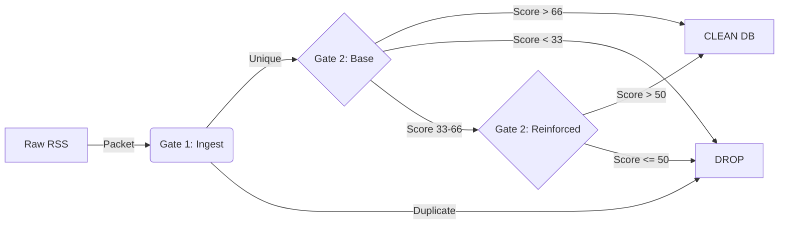

# Atlas G³ OSINT System Overview

**Atlas G³** is a multi-agent intelligence pipeline designed to ingest, filter, and verify kinetic event data with high precision. It replaces the legacy standard scraper with a 3-stage Gate architecture enforced by strict Pydantic data contracts.

## 🧠 Core Architecture

The pipeline processes raw data into verified intelligence through three strictly defined gates:

### **Gate 1: Ingestion & Deduplication**
- **Input:** Google News RSS (Targeting: *Shelling, Artillery, Drone Attack, Conflict*).
- **Mechanism:** 
  - Normalizes raw feeds into `AtlasPacket` objects.
  - Generates immutable MD5 content hashes.
  - **Deduplication:** Checks primarily against MongoDB `news_index` to prevent "Drift" (re-ingesting known reports).
- **Output:** Unique, raw packets or `DROP` (Duplicate).

### **Gate 2: Base Classification**
- **Agent:** **Gemini 2.5 Flash Lite** (High-speed, cost-effective).
- **Role:** Initial Triage.
- **Tasks:**
  1. **Classify Domain:** `KINETIC`, `POLITICAL`, `CIVIL_UNREST`, or `NOISE`.
  2. **Score Validity:** 0-100 scale.
- **Routing Logic:**
  - **> 66**: `CLEAN` (Immediate Admit).
  - **33 - 66**: `PENDING_REINFORCED` (Ambiguous - requires verification).
  - **< 33**: `DROP` (Irrelevant).

### **Gate 2: Reinforced Verification**
- **Agent:** **Gemini 3 Flash Preview** (High-reasoning).
- **Role:** Senior Analyst / Disambiguation.
- **Tasks:** 
  - deeply analyzes "Maybe" items (Score 33-66).
  - Uses "Chain of Thought" reasoning to distinguish rumors from facts.
- **Routing Logic:**
  - **> 50**: `CLEAN` (verified).
  - **<= 50**: `DROP`.

---

## 🛠 Technical Stack

| Component | Implementation |
|-----------|----------------|
| **Orchestrator** | Python / Django (`views.py`) |
| **Data Contract** | Pydantic (`atlas_schema.py`) |
| **Storage** | MongoDB (`news_index`, `raw_news_db`) |
| **LLMs** | Google Gemini 2.5 & 3.0 |
| **Observability** | Next.js Dashboard (`newosintdashboard`) |

## 📊 Data Flow

## 🔍 Observability
A real-time debug dashboard is available at:
`http://localhost:3000` (mapped to `newosintdashboard/`)
- Visualizes packet flow through all gates.
- Exposes raw validty scores and agent reasoning.
- Proxies requests to the Django backend.
